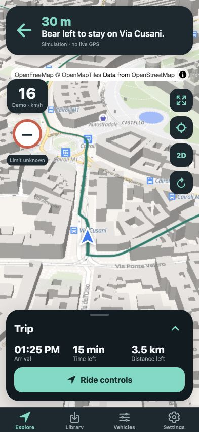
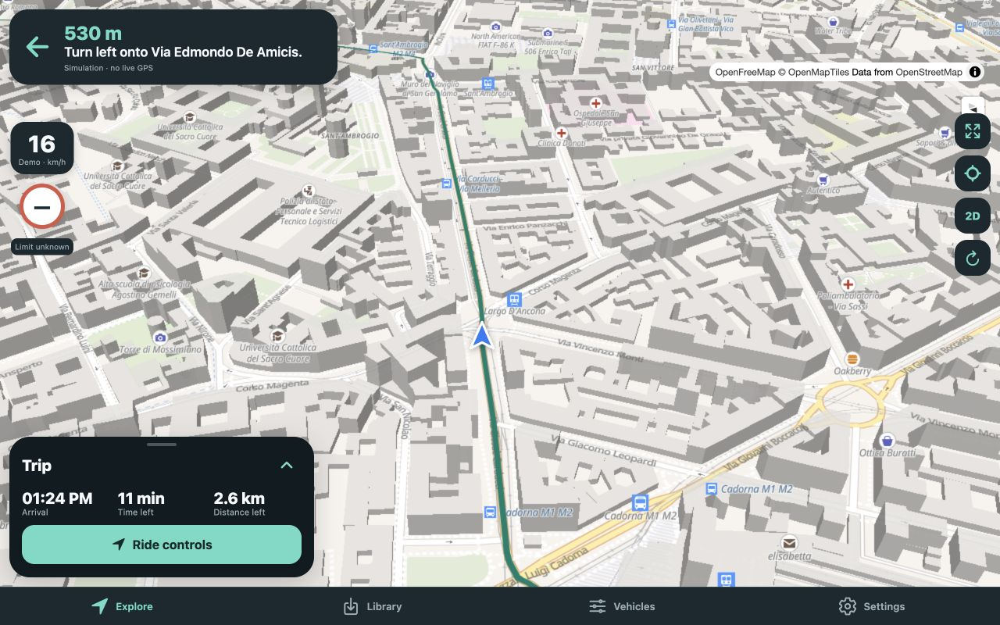

<p align="center">
  
</p>

<p align="center">
  <a href="https://github.com/Xarber/Velunivo/actions/workflows/check.yml"></a>
  <a href="https://github.com/Xarber/Velunivo/actions/workflows/release.yml"></a>
  <a href="https://github.com/Xarber/Velunivo/releases"></a>
</p>

# Velunivo

**Your route. Your riding speed.**

An iOS-first navigator and route planner for e-scooters and e-bikes. Compare bicycle and car-road candidates, estimate travel time for the vehicle you actually ride, and plan on a fullscreen map with floating controls. Built with Expo and React Native for iPhone, iPad, Android and web.

[Download releases](https://github.com/Xarber/Velunivo/releases) · [Setup guide](docs/SETUP.md) · [Build and signing guide](docs/RELEASES.md) · [Verification](docs/VERIFICATION.md) · [Brand assets](docs/BRANDING.md)

## A map first, with the essentials in reach

<p align="center">
  
  
</p>

Actual web screenshots on public Milan routes. Speed is labelled **Demo** because these captures use simulation; they are not physical-device test evidence.

## Built around your ride

| Feature | What it does |
| --- | --- |
| Bicycle + car-road choices | Real provider routes with maneuver instructions, road exclusions and mapped speed-limit checks. No-key Photon/Valhalla services are available by default. |
| Your vehicle, your ETA | Saved e-scooter/e-bike profiles with speed capability, a separate riding cap, range, icons and custom photos. Practical ETA, arrival clock, time and distance remaining. |
| Clear guidance | Foreground GPS, spoken instructions, a forward-facing navigation arrow, optional 50° perspective and a temporary full-route overview. |
| Phone to desktop | Apple MapKit on iPhone/iPad; key-free OpenFreeMap/MapLibre on Android/web. Expandable phone controls and floating tablet/desktop panels. |
| Planning + GPX | Address search, map-picked endpoints, native date/time pickers, track import/export and new route comparison between imported track endpoints. |
| Local route library | Save route snapshots locally. Native map downloads are available with an offline-licensed provider; tile downloads are disabled by default. |
| Global preferences | Km/miles, mph/km/h, compass and tilted-view settings shared across the app. |

**Scheduled ETAs exclude traffic conditions and traffic simulation.** An optional current traffic overlay does not change the ETA. Battery use is a distance/range estimate, not a battery reading.

## Get the app

[GitHub Releases](https://github.com/Xarber/Velunivo/releases) contains the APK, unsigned iPhone IPA, Apple Silicon Simulator `.app.zip`, web archive, checksums and release notes for successful builds. An iPhone IPA needs signing with your own account or an appropriate sideloading tool. A Simulator app is not an iPhone IPA.

**AltStore Classic / SideStore source:**

```text
https://github.com/Xarber/Velunivo/releases/download/1.0/apps.json
```

The special **1.0** release hosts the mutable source feed and app icon. Actual app versions use `v`-prefixed tags. Builds run on GitHub using Xcode beta and the latest stable Android SDK available to SDK Manager, without EAS. Native app branding changes require a new binary.

## Run the web planner

Requires Node 22.13+ (Node 24 recommended) and npm.

```sh
git clone https://github.com/Xarber/Velunivo.git
cd Velunivo
npm ci
npm run web
```

Address search and routing work through public Photon/Valhalla services when no routing URL is set. They have fair-use limits and no production service guarantee. Use the optional server or self-hosted/contracted providers for deployment; see [configuration and privacy details](docs/SETUP.md#configure-addresses-routing-and-traffic).

For a production export and local preview on port 8082, run `npm run web:preview`. Native development requires a development build and installed platform tools; Expo Go cannot run this project. [Full setup](docs/SETUP.md).

## Current boundaries

Velunivo is an MVP. Physical-device compass/GPS/voice and offline pack downloads still need target testing. Scooter access cannot be certified from bicycle/car access or incomplete OpenStreetMap data; inspect signs and local rules. Unknown street limits remain unknown. New vehicle profiles start at a generic 25 km/h capability; configure your actual capability and local riding cap.

Automatic rerouting, background navigation, offline route calculation and hill/weather energy models are not implemented. A saved route can be followed offline, but a new route needs an online routing provider. Imported geometry-only GPX tracks have no invented turn instructions. [Test evidence and remaining work](docs/VERIFICATION.md).

## Development

```sh
npm run lint
npm run typecheck
npm test
npm run brand:generate  # Rebuild raster assets from the shared vector design
```

[Architecture](docs/ARCHITECTURE.md) · [Work log](docs/WORKLOG.md) · [Contributing](CONTRIBUTING.md) · [Privacy](PRIVACY.md)

Maps and route data retain their providers’ attribution and terms. Original brand geometry and editable SVG exports are included; see [branding](docs/BRANDING.md).
